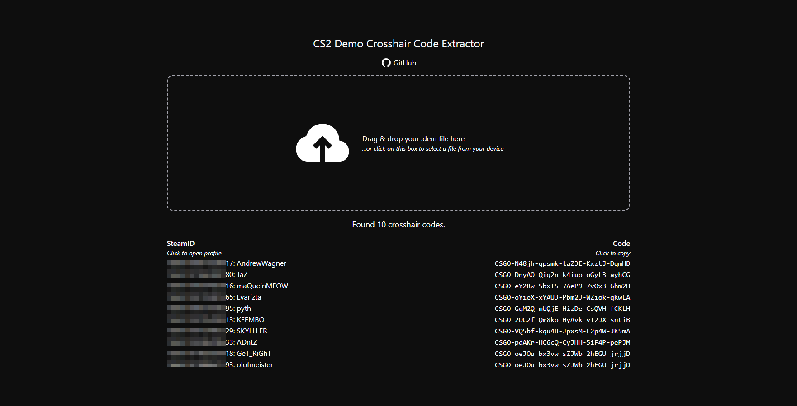

# Demo Crosshair Code

Parse crosshair codes out of any CS2 demo you want! **CSGO is not supported.**

**Available at [beepisla.github.io/demo-crosshair-code](https://beepisla.github.io/demo-crosshair-code/)**

## Build

Just follow the steps in `.github/workflows/build.yml`.

## Credits

- [LaihoE's demoparser](https://github.com/LaihoE/demoparser)
- [Svelte](https://kit.svelte.dev/)
- [Tailwind](https://tailwindcss.com/)
